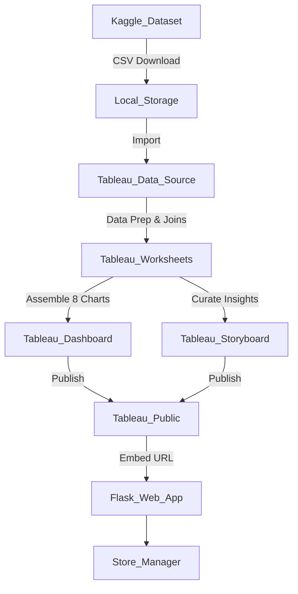

# Data Flow Diagrams & User Stories

## Data Flow Diagram (DFD) description
Data originates from Kaggle as a raw CSV file. It is then imported into Tableau where calculated fields and aggregations are applied. The processed data is visualized across 8 individual worksheets, which are finally consolidated into an interactive Dashboard and a 3-scene Storyboard. The Tableau workbook is published to Tableau Public, and the resulting public URL is embedded into a custom Flask web application UI.

## User Stories

* **As a** Store Manager, **I want to** see the Average Sales Volume by Product Category in a web browser, **so that I can** identify our top-performing product types without needing Tableau installed.
* **As a** Merchandiser, **I want to** compare Competitor Price vs Price by category using interactive filters, **so that I can** ensure our pricing strategy remains competitive.
* **As a** Retail Executive, **I want to** view a 3-scene Tableau Storyboard embedded in our internal portal, **so that I can** quickly grasp key insights regarding product placement.
* **As a** Tableau Developer, **I want to** publish the finalized dashboard to Tableau Public, **so that I can** securely embed it into a Flask web application using HTML iframe/script tags.
