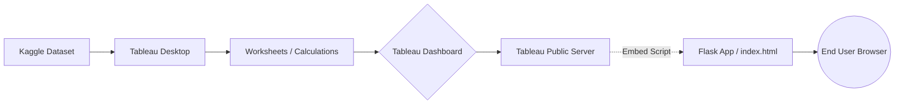

# Solution Architecture

## Architecture Overview
The project follows a standard Data Visualization & Web Embedding pipeline: Data Extraction (Kaggle) -> Local Storage -> Data Ingestion & Transformation (Tableau Data Source) -> Visualization (Worksheets) -> Dashboard/Story Assembly -> Tableau Public Publishing -> Flask Web Integration.

## System Components
1. **Data Source:** `Product Positioning.csv` containing 1,000 records.
2. **Data Preparation Layer:** Tableau's internal data engine computing Calculation Fields (Price, Competitors Price, Sales Volume).
3. **Tableau Worksheets & Dashboard:** The 8 individual charts and the aggregated fixed-size interactive dashboard.
4. **Tableau Public:** The cloud hosting layer where the dashboard and story are published, generating an HTML embed script.
5. **Flask Web Server:** A Python micro-server (`app.py`) that handles HTTP requests and serves the HTML interface.
6. **Web UI (Frontend):** The `index.html` template where the Tableau Public embed code is executed, displaying the dashboard interactively inside a custom web portal.

## Integration Points
- **Flask to Tableau Public:** The Flask frontend uses a standard Tableau JavaScript API or `<iframe>` embed code to pull the live published dashboard directly from Tableau's servers into the web UI.

## Diagram

